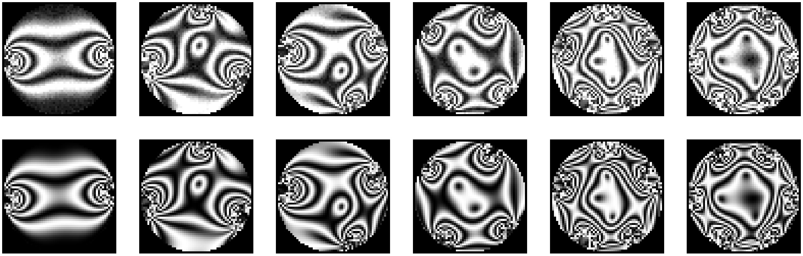

```{r setup, include=FALSE, echo=FALSE}
knitr::opts_knit$set(root.dir = getwd())
```

## CNN-based Reconstruction of Forces for Photoelastic Particles

### Abstract 

Photoelastic techniques have a long tradition in both qualitative and quantitative analysis of the stresses in granular materials. Over the last two decades, computational methods for reconstructing forces between particles from their photoelastic response have been developed by many different experimental teams. Unfortunately, all of these methods are computationally expensive. This  limits their use for processing extensive data sets that capture the time evolution of granular ensembles consisting of a large number of particles. In this repository, we present a novel approach to this problem which leverages the power of convolutional neural networks to recognize complex spatial patterns. The main drawback of using neural networks is that training them  usually requires a large labeled data set which is hard to obtain experimentally.  Hence, our networks were trained on synthetically generated data. In our paper, we show that a relatively small sample of real data is then needed to adapt models to perform well on the experimantal data. One could find more about hwo the models were constucted in our paper here: ...

### Instructions on using the models

Running the model on the provided test data:

1. Install `Anaconda` from [here](https://docs.anaconda.com/anaconda/install/).
2. Install `Tensorflow` on top of `Anaconda` using `conda install tensorflow` command in the terminal. Consult the guide [here](https://docs.anaconda.com/anaconda/user-guide/tasks/tensorflow/).
3. Make sure you have the folllowing packages installed: `numpy`, `pandas`, `matplotlib`, `scikit-learn`, and `scipy`.
4. For convenience, please, install `Spyder` IDE for Python in `Anaconda`.
5. Clone our repository to your local machine. Make sure that you are also downloading the trained models folder. For this you may need to install `git lfs` extension from [here](https://git-lfs.github.com/).
6. Open and run the `test.py` file. This step produces predictions, which would stored in the `image_data` folder.
7. Open and run the `view_test.py`. The output should be 

Running the model on other data:

1. Apply steps `1-4` above.
2. Convert your image data into `numpy` array such that the data matrix has dimesions `n * h * w * ch`, where `n` is the number of images, `h, w` are height and width of the images, and `ch` is the number of channels. Our models only works on the greyscale data, hence, the paraemter `ch` will be assumed to be equal to `1` and can be omitted in the matrix.  
The most straightforward way for converting images to a matrix is through a Python package `Pillow`, the guidelines for which can be found [here](https://pillow.readthedocs.io/en/stable/index.html).  
Additionally, the images should have resolution `56 x 56` with pixel values in the range `[0, 1]`. To achieve this, the images need to be preprocessed. One way to do the pre-processing is manually through `numpy` and `scipy` packages in Python: the `scipy.misc.imresize` could be used for the resizing. Using `numpy`, the image data could be standartized by subtracting the `min` of all the pixels and dividing by the `max` of all the pixels.
3. Save the data in the `.npy` file format and store it in the `image_data` folder. Rename your data to `data.npy`.
4. Open and run the `test.py` file. The predicted data should be now saved into the `image_data` folder. The additional index file defines the mapping between the predictions and the true images, because the predictions may be shuffled by the models. 
5. You can view the predicted and the true images using the `view_test.py`.


### File description

1. `class.py` defines classes for representing particles and forces;
2. `force_list.py` generates the synthetic force list for data generation;
3. `photoelastic_response.py` defines functions for calculating the intensity field based on the provided forces;
4. `image_generator.py` generates images based on the intensity field;
5. `datagen_template.py` is the image generator combining `1-4` above into a pipeline;
6. `test_functions.py` defines set of functions for loading and handling the supplied data, and running the models on it;
7. `test.py` is the script that operates functions defined in `6` to run the models on the supplied data.
8. `view_test.py` is the script letting the user view the results of predictions; as such it lets the user compare the supplied images with the images generated based on the forces predicted by the models. 


